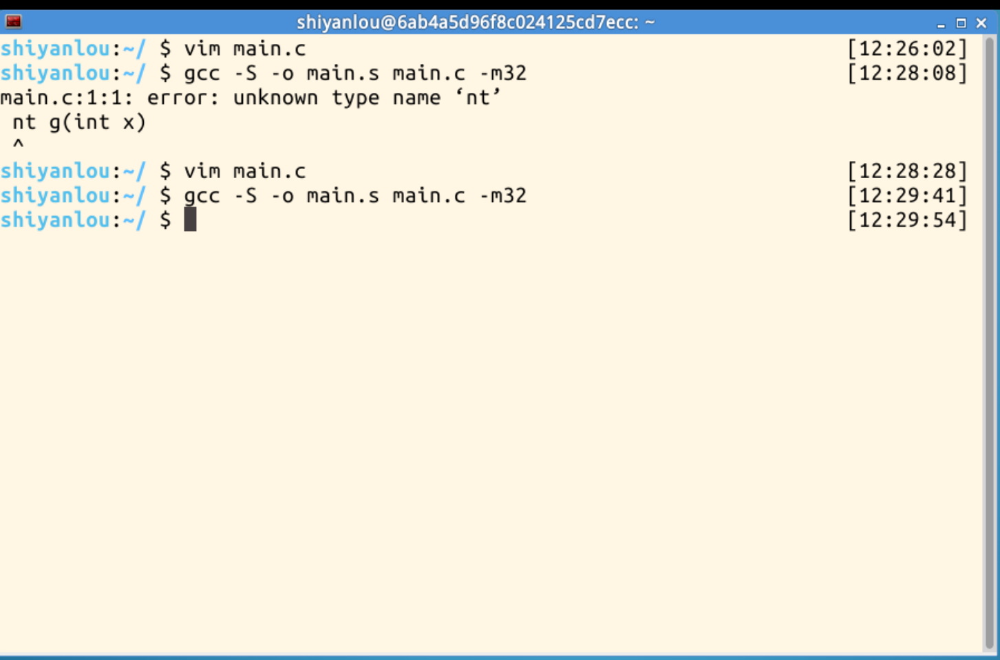
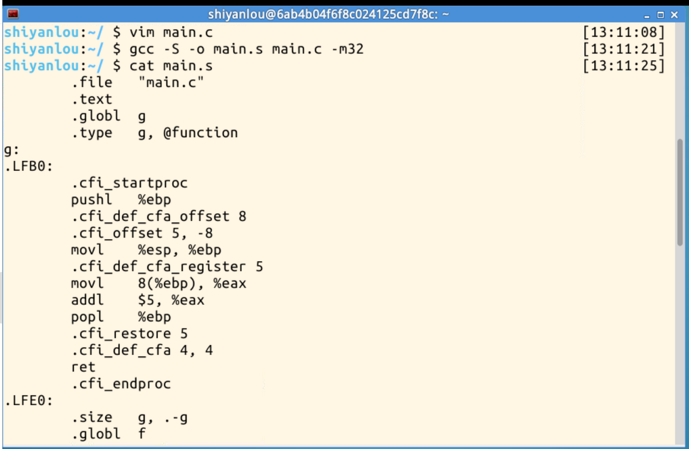
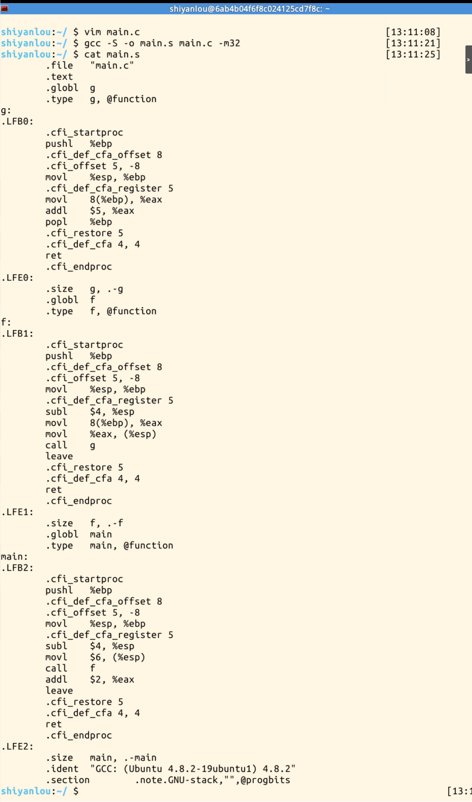

# 从 C 函数到 32 位汇编：一次函数调用中的栈变化

**真实姓名：** 姚翔  
**学号：** 20262822  
**实验名称：** Linux 内核分析实验三  
**实验环境：** 实验楼 64 位 Linux 虚拟机中的 32 位汇编编译环境  
**实验日期：** 2026 年 9 月 24 日  

原创作品转载请注明出处。  
《Linux内核分析》MOOC课程 [http://mooc.study.163.com/course/USTC-1000029000](http://mooc.study.163.com/course/USTC-1000029000)

## 一、实验目标

本实验使用 GCC 将 C 程序编译成 32 位 AT&T 格式汇编，观察 `main` 调用 `f`、`f` 调用 `g` 的过程，重点分析函数序言、函数尾声、参数传递、返回值以及栈指针和帧指针的变化，从而理解一条 C 语句如何落到处理器可执行的指令上。

## 二、源程序与编译

为避免和其他同学完全相同，我使用了如下数值：

```c
int g(int x)
{
    return x + 5;
}

int f(int x)
{
    return g(x);
}

int main(void)
{
    return f(6) + 2;
}
```

编译命令为：

```bash
gcc -S -o main.s main.c -m32
cat main.s
```

第一次输入时把 `int` 误写成了 `nt`，编译器提示 `unknown type name 'nt'`；修正源程序后再次执行命令，生成汇编文件成功。截图还说明本实验采用 AT&T 语法：源操作数在前，目标操作数在后，例如 `movl 8(%ebp), %eax` 表示把栈中参数取到 `%eax`。



图1：第一次编译因类型名拼写错误失败，修正为 `int` 后编译命令正常返回。

## 三、汇编代码的整体结构

GCC 为每个函数生成相似的结构。`.text` 表示代码段，`.globl` 让函数符号可以被链接器看到，`.type` 标记函数类型，`.cfi_*` 指令用于调试和异常展开，本身不改变业务计算。真正完成调用和计算的是 `pushl`、`movl`、`subl`、`movl`、`call`、`addl`、`leave` 和 `ret`。



图2：`g` 的序言保存旧 `%ebp`、建立新栈帧，随后从 `8(%ebp)` 读取第一个参数并加上常数 5。



图3：`f` 为调用 `g` 准备参数并执行 `call g`；`main` 为调用 `f` 准备参数，返回后在 `%eax` 中加 2。

## 四、g( x )：最内层函数的栈帧

进入 `g` 前，调用者已经把参数压入栈中，`call g` 又把返回地址压入栈顶。假设进入函数前 `%esp = S`，则 `call` 完成后栈顶为 `S-4`，这里保存返回地址。

```asm
pushl %ebp
movl  %esp, %ebp
movl  8(%ebp), %eax
addl  $5, %eax
popl  %ebp
ret
```

`pushl %ebp` 再把调用者的帧指针保存到 `S-8`，同时 `%esp` 减 4；`movl %esp,%ebp` 令 `%ebp` 指向当前栈帧基址。此时 `0(%ebp)` 是保存的旧 `%ebp`，`4(%ebp)` 是返回地址，`8(%ebp)` 是参数 `x`。因此 `movl 8(%ebp),%eax` 取出参数，`addl $5,%eax` 计算 `x+5`，并把返回值放在 ABI 约定的 `%eax` 中。

`popl %ebp` 恢复调用者的帧指针并让 `%esp` 回到返回地址位置；`ret` 弹出返回地址装入指令指针，程序回到 `f` 中 `call g` 的下一条指令。`g` 没有局部变量，所以建立栈帧主要是为了形成稳定的参数访问位置。

## 五、f( x )：参数压栈与嵌套调用

`f` 的关键指令如下：

```asm
pushl %ebp
movl  %esp, %ebp
subl  $4, %esp
movl  8(%ebp), %eax
movl  %eax, (%esp)
call  g
leave
ret
```

进入 `f` 后先保存旧帧指针并建立新帧。`subl $4,%esp` 为一个 4 字节的临时参数槽留出空间；`movl 8(%ebp),%eax` 读取 `f` 的参数，再用 `movl %eax,(%esp)` 把它放到栈顶。`call g` 随后压入返回地址，`g` 看到的 `8(%ebp)` 就是这个参数。

`g` 返回时结果仍在 `%eax`，`f` 没有再计算，直接通过 `leave` 和 `ret` 恢复自己的栈帧并返回给 `main`。`leave` 等价于先把 `%ebp` 复制给 `%esp`，再弹出旧 `%ebp`，因此能一次性丢弃 `f` 的临时空间。

## 六、main：从常量到最终返回值

`main` 的核心片段是：

```asm
pushl %ebp
movl  %esp, %ebp
subl  $4, %esp
movl  $6, (%esp)
call  f
addl  $2, %eax
leave
ret
```

`main` 把常量 6 放入参数槽后调用 `f(6)`。调用链为 `main -> f -> g`：`g` 返回 `6+5=11`，`f` 原样返回 11，`main` 执行 `addl $2,%eax` 得到 13，最后通过 `ret` 将 13 作为进程退出状态返回给操作系统。这里的返回值计算完全对应 C 表达式 `f(6) + 2`。

从栈的角度看，每次 `call` 都会增加一个返回地址，每个函数的 `pushl %ebp` 都保存上一层栈帧。返回时，`leave`/`popl %ebp` 和 `ret` 按相反顺序恢复现场，所以嵌套调用能够准确回到各自的下一条指令。

## 七、实验中遇到的问题

1. 第一次编译报 `unknown type name 'nt'`，原因是函数返回类型拼写错误；改为 `int` 后重新编译成功。
2. `-m32` 依赖 32 位编译支持。若在普通 64 位发行版中提示缺少 `32` 位头文件或库，应安装对应的 multilib 开发包；这属于环境配置问题，不是 C 代码逻辑错误。
3. 截图中的汇编由具体 GCC 版本生成，局部指令（例如是否预留临时空间）可能随编译器选项变化，但函数调用的核心约定、返回值寄存器和栈帧组织仍可按上述方法分析。

## 八、总结：我理解的“计算机是如何工作的”

这次实验让我看到，计算机并不是直接“理解”`f(6)+2` 这样的高级表达式，而是把它逐步翻译为寄存器和内存之间的移动、加法、压栈、跳转和返回。栈保存参数、返回地址和上一层函数的现场，寄存器承担当前计算，`call` 与 `ret` 把控制流连接起来。C 语言中的函数嵌套，最终表现为一组严格遵守调用约定的机器指令。理解这些细节后，我对“计算机是如何工作的”的认识从抽象的程序运行，变成了可以沿着指令、寄存器、栈和返回地址逐步追踪的具体过程。
