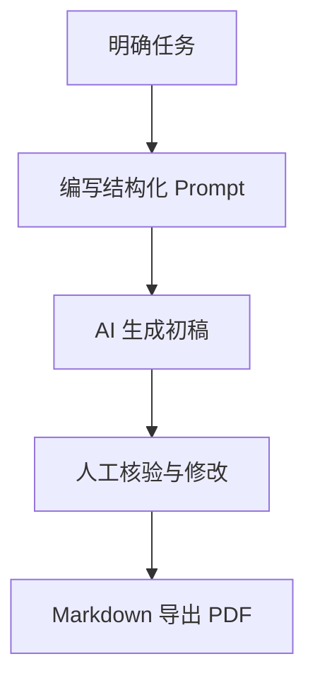

# Linux课程作业：Markdown 与 AI 提示词工程实践

> 课程：Linux课程  
> 完成日期：2026年9月20日

## 一、AI平台学习 Markdown

这次作业我用 ChatGPT 帮忙学习 Markdown。主要看了基础语法、常用工具、高级功能，还有 Markdown 在写提示词时怎么用。

Markdown 是一种轻量级标记语言。它直接用普通文本和几个符号写格式，比较好上手。Linux 里用文本编辑器就能写，也方便放到 Git 里管理，还能转成 HTML 和 PDF。

## 二、Markdown 基础语法

### 1. 标题

```markdown
# 一级标题
## 二级标题
### 三级标题
```

### 2. 列表

```markdown
- 无序列表
- Markdown
  - 标题
  - 表格

1. 编写文档
2. 导出 PDF
3. 提交作业
```

### 3. 链接、表格与代码

链接写法为 `[显示文字](链接地址)`，图片写法为 ``。

| 语法类别 | 示例 | 用途 |
| --- | --- | --- |
| 粗体 | `**重要内容**` | 强调重点 |
| 行内代码 | ``ls -la`` | 命令或变量 |
| 引用 | `> 内容` | 引用说明 |

代码块使用三个反引号，可指定语言：

```bash
# 查看当前目录中的文件
ls -la
```

```python
def hello(name):
    return f"Hello, {name}!"
```

## 三、Markdown 工具推荐

| 类型 | 工具 | 特点 |
| --- | --- | --- |
| 在线工具 | StackEdit | 在浏览器中编写，支持预览、同步和导出。 |
| 在线工具 | Dillinger | 界面简洁，适合快速编辑和导出。 |
| 离线工具 | Visual Studio Code | 免费、插件丰富，适合 Markdown 和代码。 |
| 离线工具 | Typora | 所见即所得编辑，适合日常笔记和文档写作。 |

这次我用文本编辑器写 Markdown，再把它转成 PDF。需要复杂排版时，可以用 VS Code 扩展、Typora 或 Pandoc。

## 四、Markdown 高级用法与实践

### 1. 数学公式

许多 Markdown 渲染器支持 LaTeX。行内公式用一对美元符号，独立公式用两对美元符号。

```markdown
行内公式：$E = mc^2$

$$
\sum_{i=1}^{n} i = \frac{n(n+1)}{2}
$$
```

行内公式示例：$E = mc^2$。

### 2. Mermaid 绘图

Mermaid 能将文本描述渲染为流程图、时序图等，适合技术文档维护。



### 3. 制作 PPT

Markdown 可通过 Marp、Slidev 或 Pandoc 制作演示文稿。Marp 使用 `---` 分隔幻灯片：

```markdown
---
marp: true
---

# Markdown 介绍

---

## 优点
- 简洁
- 易于版本管理
```

### 4. 格式转换

Pandoc 是 Linux 中常用的转换工具：

```bash
pandoc report.md -o report.pdf
pandoc report.md -o report.docx
```

如果 PDF 包含中文和数学公式，需要配置中文字体和 LaTeX 环境，也可以使用 Typora 直接导出。

## 五、学习反思与实际操作

### 已掌握的内容

- 使用标题组织文档层级；
- 编写无序列表、有序列表、链接、图片、表格和代码块；
- 使用 GitHub 保存、展示 Markdown 文档；
- 使用 Linux 命令行查看和编辑文本文件。

### 学习前未完全掌握的内容

- 用 LaTeX 在 Markdown 中编写数学公式；
- 用 Mermaid 以文本方式绘制流程图；
- 使用 Marp 将 Markdown 制作为 PPT；
- 使用 Pandoc 或其他工具稳定地将 Markdown 转换为 PDF。

### 本次实践结果

本次实践已完成：

1. 在本文件中输入 LaTeX 数学公式；
2. 编写 AI 辅助写作流程的 Mermaid 流程图源码；
3. 编写 Marp 幻灯片最小示例；
4. 将本 Markdown 文档转换为 PDF，并检查标题、表格、代码块和页码的显示。

我觉得 Markdown 不只是排版方便。它是纯文本，方便修改和保存版本，写学习笔记、实验报告、项目说明和提示词都挺合适。

## 六、Markdown 在 AIGC 提示词工程中的应用

AI 会根据提示词的层次、限制和例子理解任务。用 Markdown 的标题、列表、表格和代码块把要求分开写，AI 更不容易理解错。

```markdown
# 角色
你是一名网络安全课程助教。

## 上下文
读者是刚接触 Linux 的研究生。

## 任务
解释文件权限，并给出三个练习命令。

## 输出要求
- 使用中文；
- 分为“概念、示例、练习”三节；
- 不执行破坏性命令。
```

像网络安全和密码学这类问题，最好再写清楚数据来源、假设条件和限制。AI 给出的结果也要自己检查，不能直接照搬。

## 七、结构化提示词框架：ICDO

本次选择 ICDO 框架：

| 要素 | 含义 | 作用 |
| --- | --- | --- |
| I - Instruction | 指令 | 明确希望 AI 完成什么。 |
| C - Context | 上下文 | 交代读者、场景、已有信息和限制。 |
| D - Data | 数据 | 提供需要处理的材料、事实或样例。 |
| O - Output | 输出 | 规定格式、篇幅、语言、质量标准。 |

ICDO 和题目要求的角色、上下文、任务正好能对应起来。角色可以写在指令或上下文里，任务就是 Instruction，背景就是 Context，输出格式就是 Output。如果材料不够，也应该让 AI 说清楚缺什么，不能自己编。

### ICDO 通用 Markdown Prompt 模板

```markdown
# Role / 角色
你是一名【专业领域】专家，擅长【具体能力】。

## I - Instruction / 指令
请完成以下任务：
1. 【任务一】
2. 【任务二】

## C - Context / 上下文
- 目标读者或用户：【读者特征】
- 使用场景：【场景】
- 已知条件与限制：【时间、工具、合规要求】
- 目标：【希望达到的结果】

## D - Data / 数据
请基于以下材料处理；若信息不足，请明确指出，不要虚构：

```text
【粘贴题目、日志、代码、数据或参考资料】
```

## O - Output / 输出要求
- 语言：【中文/英文】
- 格式：【Markdown/表格/JSON/代码】
- 篇幅：【字数或条目数】
- 必须包含：【关键内容】
- 禁止或注意事项：【安全、隐私、事实核验等要求】

## Quality Check / 自检
输出前检查：是否完整回答任务、是否符合格式、是否存在未经证实的结论。
```

### 模板使用示例

```markdown
# Role / 角色
你是一名 Linux 系统管理教师。

## I - Instruction / 指令
为研究生设计一份“文件权限”入门练习。

## C - Context / 上下文
- 学生会使用基本命令，但不熟悉 chmod；
- 实验环境为虚拟机；
- 练习不得修改系统关键文件。

## D - Data / 数据
需要覆盖 rwx、chmod 数字表示法和 ls -l 输出解读。

## O - Output / 输出要求
- 用中文 Markdown 输出；
- 包含概念说明、3 个命令示例、2 道练习题和答案；
- 每条命令说明风险与预期结果。
```

## 八、总结

这次学习让我把 Markdown 的基本写法、公式、流程图、PPT 和文件转换大概串起来了，也实际写了几个例子。写 AI 提示词时，用 Markdown 分清角色、背景、任务和输出要求会更清楚。以后遇到 Linux、安全或密码相关的问题，我会先把需求写明白，再检查 AI 的回答对不对。

## 参考链接

- [Markdown Guide](https://www.markdownguide.org/)
- [GitHub Markdown 文档](https://docs.github.com/zh/get-started/writing-on-github)
- [Mermaid 官方文档](https://mermaid.js.org/)
- [Pandoc 官方网站](https://pandoc.org/)
